# MoneyStyle — Project Documentation

> **Domain:** moneystyle.app
> **Version:** March 2026
> **Platform:** Web (PWA — Mobile-First)

---

## Table of Contents

1. [Executive Summary](#1-executive-summary)
2. [Product Overview](#2-product-overview)
3. [Architecture Overview](#3-architecture-overview)
4. [Tech Stack](#4-tech-stack)
5. [System Architecture Diagram](#5-system-architecture-diagram)
6. [Database Schema](#6-database-schema)
7. [Application Structure](#7-application-structure)
8. [Authentication & Authorization](#8-authentication--authorization)
9. [Feature Map](#9-feature-map)
10. [API Reference](#10-api-reference)
11. [AI Integration](#11-ai-integration)
12. [Third-Party Integrations](#12-third-party-integrations)
13. [Infrastructure & Deployment](#13-infrastructure--deployment)
14. [Data Flow Diagrams](#14-data-flow-diagrams)
15. [Security Considerations](#15-security-considerations)
16. [PWA & Offline Support](#16-pwa--offline-support)
17. [Analytics & SEO](#17-analytics--seo)
18. [Feature Flags](#18-feature-flags)
19. [Development Guide](#19-development-guide)
20. [Glossary](#20-glossary)

---

## 1. Executive Summary

**MoneyStyle** is a full-stack, AI-powered personal finance tracking platform designed with a mobile-first approach. It helps users track expenses, manage income, set budgets, plan savings goals, and receive AI-driven financial insights — all through an intuitive, modern interface.

### Key Value Propositions

- **Smart Transaction Management** — Manual entry, receipt scanning, Telegram bot, and SMS auto-import
- **AI-Powered Insights** — Wealth scoring, spending predictions, bill negotiation, meal & weekend planning
- **Multi-User Households** — Shared financial management with invitation system
- **Developer-Friendly API** — RESTful API with key-based authentication
- **Progressive Web App** — Installable on mobile with offline support

### Target Users

- Individuals managing personal finances
- Households sharing expenses
- Users in the Middle East market (multi-currency, Persian numeral support)

---

## 2. Product Overview

### User Journey

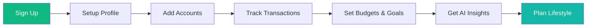

### Core Modules

| Module | Description |
|--------|-------------|
| **Dashboard** | Real-time financial overview with charts, heatmaps, budgets |
| **Transactions** | Full CRUD with splitting, tagging, receipt scanning |
| **Profile** | Income sources, bills, installments, reserves, savings goals |
| **Lifestyle** | AI weekend planner, meal planner, shopping lists, money advice |
| **Wealth Pilot** | AI-generated wealth score and 1/3/5-year projections |
| **Money Chat** | Conversational AI assistant for financial questions |
| **Settings** | Integrations (Telegram, SMS), feature flags, API keys |

---

## 3. Architecture Overview

MoneyStyle follows a **monolithic** Next.js architecture with the App Router pattern, using Server Actions for backend logic and Prisma ORM for database access.

### High-Level Architecture

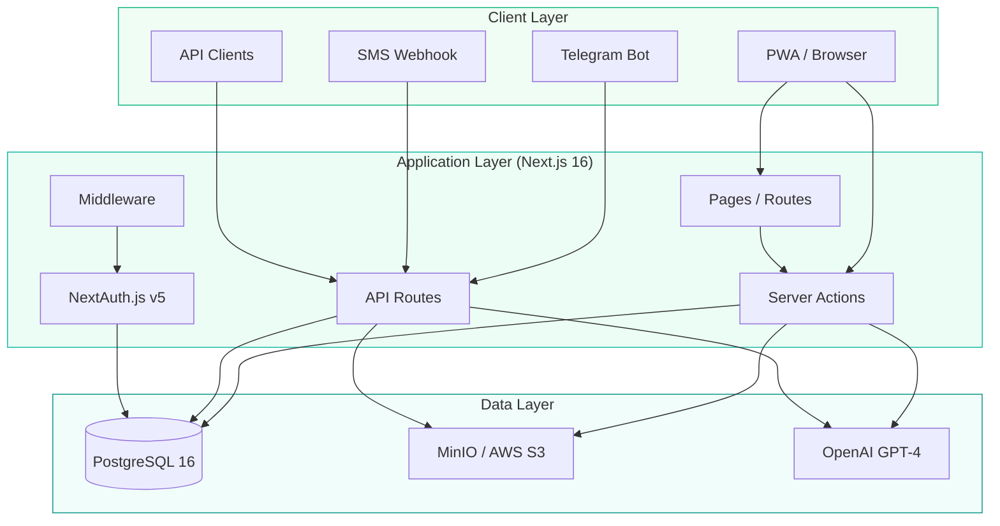

### Request Flow

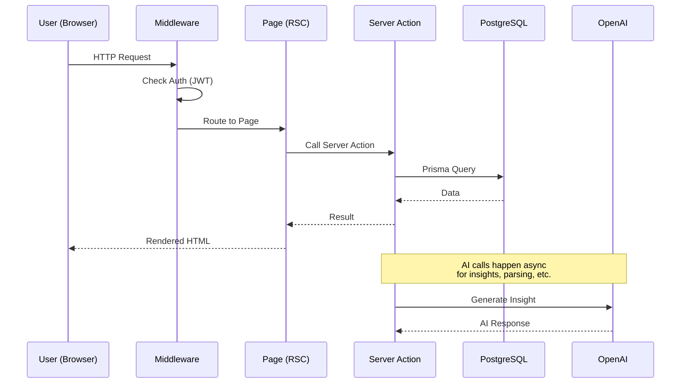

---

## 4. Tech Stack

### Stack Diagram

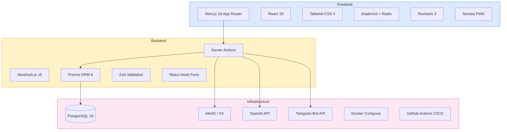

### Dependency Summary

| Category | Technology | Version |
|----------|-----------|---------|
| Runtime | Node.js | 22 |
| Package Manager | pnpm | 10.29 |
| Framework | Next.js | 16.1.6 |
| UI Library | React | 19 |
| Language | TypeScript | 5 (strict) |
| CSS | Tailwind CSS | 4 |
| Components | shadcn/ui + Radix UI | Latest |
| Charts | Recharts | 3.7 |
| ORM | Prisma | 6.19 |
| Database | PostgreSQL | 16 |
| Auth | NextAuth.js | v5 |
| AI | OpenAI SDK | Latest |
| Storage | MinIO (dev) / S3 (prod) | — |
| PWA | Serwist | 9.5 |
| Validation | Zod | Latest |
| Forms | React Hook Form | Latest |
| Notifications | Sonner | Latest |
| Icons | Lucide React | Latest |

---

## 5. System Architecture Diagram

### Full System Map

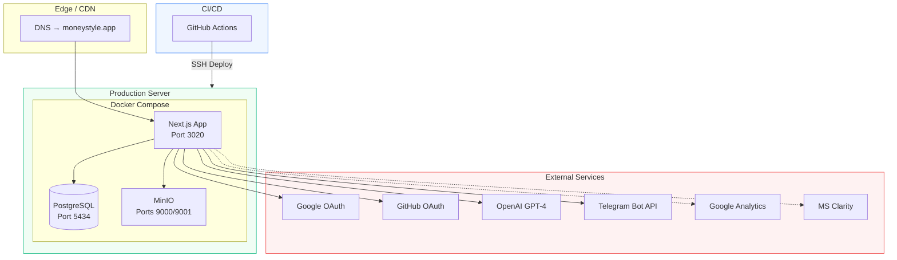

---

## 6. Database Schema

### Entity Relationship Diagram (Core)

```mermaid
erDiagram
    User ||--o{ Transaction : creates
    User ||--o{ Account : owns
    User ||--o{ Category : defines
    User ||--o{ IncomeSource : has
    User ||--o{ Bill : tracks
    User ||--o{ Installment : manages
    User ||--o{ SavingsGoal : sets
    User ||--o{ Reserve : holds
    User ||--o{ Budget : configures
    User ||--o{ Tag : creates
    User ||--o| AppSettings : has
    User ||--o| Household : belongs_to

    Transaction }o--|| Account : from
    Transaction }o--|| Category : belongs_to
    Transaction ||--o{ TransactionSplit : has
    Transaction ||--o{ TransactionItem : contains
    Transaction ||--o{ TransactionTag : tagged

    TransactionItem }o--o| ItemGroup : grouped_by

    Bill ||--o{ BillPayment : payments
    Installment ||--o{ InstallmentPayment : payments

    IncomeSource ||--o{ IncomeDeposit : deposits

    Household ||--o{ HouseholdMember : members
    Household ||--o{ HouseholdInvite : invites

    User ||--o{ WeekendPlan : generates
    User ||--o{ MealPlan : generates
    User ||--o{ ShoppingList : creates
    User ||--o{ ChatSession : chats
    User ||--o{ WealthPlan : has
    User ||--o{ Person : knows
    Person ||--o{ Settlement : settles
```

### Model Groups

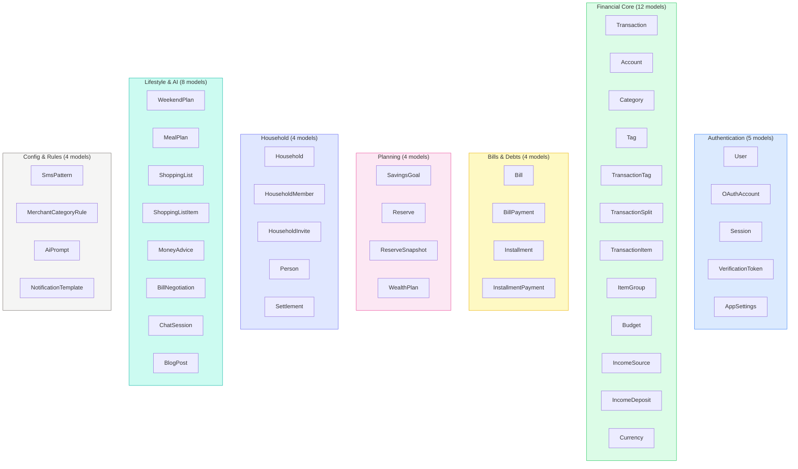

### Key Models Detail

| Model | Fields | Purpose |
|-------|--------|---------|
| **User** | id, name, email, password, image, role, householdId | Core user identity |
| **Transaction** | id, amount, type, date, description, accountId, categoryId, media[], isConfirmed | Financial record |
| **Account** | id, name, type, balance, currency, color, icon | Bank/cash/investment |
| **Category** | id, name, color, icon, type (expense/income) | Transaction grouping |
| **Budget** | id, categoryId, amount, month, year | Monthly spending limit |
| **IncomeSource** | id, name, type, amount, frequency, isActive | Salary, freelance, etc. |
| **Bill** | id, name, amount, dueDay, frequency, autoPay | Recurring obligations |
| **SavingsGoal** | id, name, targetAmount, currentAmount, deadline | Financial targets |
| **Reserve** | id, type, name, amount, unit, purchasePrice | Cash, gold, crypto |
| **AppSettings** | userId, currency, telegramChatId, smsEnabled, apiKey, featureFlags | Per-user config |

---

## 7. Application Structure

### Directory Layout

```
src/
├── app/                          # Next.js App Router
│   ├── (app)/                    # Protected routes (authenticated)
│   │   ├── dashboard/            # Main dashboard
│   │   ├── transactions/         # Transaction management
│   │   │   ├── manage/           # Accounts, categories, persons
│   │   │   ├── merge/            # Duplicate detection
│   │   │   └── prices/           # Price analysis
│   │   ├── profile/              # Financial profile
│   │   │   ├── income/
│   │   │   ├── cashflow/
│   │   │   ├── payments/
│   │   │   ├── subscriptions/
│   │   │   ├── goals/
│   │   │   ├── household/
│   │   │   └── personal/
│   │   ├── wealth/               # Wealth Pilot (AI)
│   │   ├── chat/                 # Money Chat (AI)
│   │   ├── lifestyle/            # Lifestyle features
│   │   │   ├── weekend/
│   │   │   ├── meals/
│   │   │   ├── shopping/
│   │   │   ├── negotiate/
│   │   │   └── advice/
│   │   ├── settings/             # App settings
│   │   │   ├── integrations/
│   │   │   ├── transactions/
│   │   │   ├── features/
│   │   │   └── advanced/
│   │   └── blog/admin/           # Blog CMS (admin)
│   │
│   ├── (public)/                 # Public routes
│   │   ├── about/
│   │   ├── blog/
│   │   ├── changelog/
│   │   ├── pricing/
│   │   ├── features/[slug]/
│   │   └── docs/api/
│   │
│   ├── auth/                     # Auth pages
│   │   ├── login/
│   │   ├── register/
│   │   └── telegram-miniapp/
│   │
│   └── api/                      # API routes
│       ├── auth/[...nextauth]/
│       ├── v1/                   # Public REST API
│       ├── upload/
│       ├── media/
│       ├── telegram/
│       ├── sms/
│       ├── parse-receipt/
│       └── cron/
│
├── actions/                      # 27 Server Action files
├── components/                   # 141 React components
│   ├── ui/                       # Base UI (shadcn)
│   ├── dashboard/                # Dashboard widgets
│   ├── transactions/             # Transaction components
│   ├── profile/                  # Profile sections
│   ├── settings/                 # Settings forms
│   ├── layout/                   # Navigation
│   ├── lifestyle/                # Lifestyle features
│   ├── landing/                  # Landing page
│   ├── auth/                     # Auth components
│   └── ...                       # Other feature components
│
├── hooks/                        # 6 Custom React hooks
└── lib/                          # 27 Utility files
    ├── auth.ts                   # NextAuth config
    ├── db.ts                     # Prisma client
    ├── storage.ts                # MinIO/S3 abstraction
    ├── telegram.ts               # Telegram bot
    ├── ai-prompts.ts             # AI templates
    ├── feature-flags.ts          # Feature flag system
    ├── validators.ts             # Zod schemas
    ├── sms-parser.ts             # SMS parsing
    ├── anomaly.ts                # Anomaly detection
    ├── auto-categorize.ts        # ML categorization
    └── types.ts                  # TypeScript interfaces
```

### Component Architecture

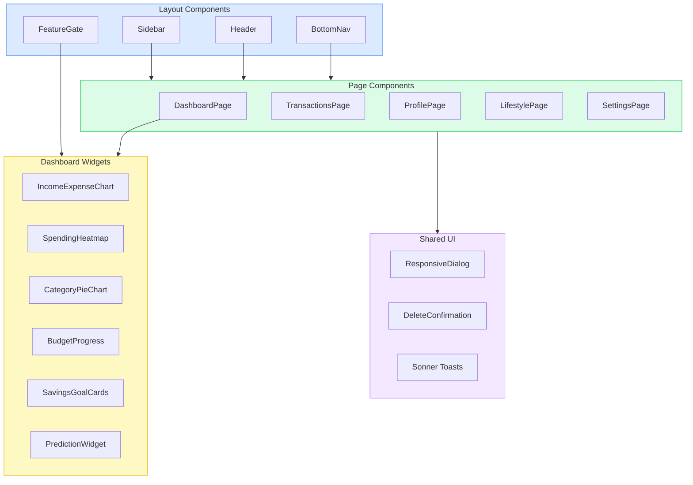

---

## 8. Authentication & Authorization

### Auth Flow

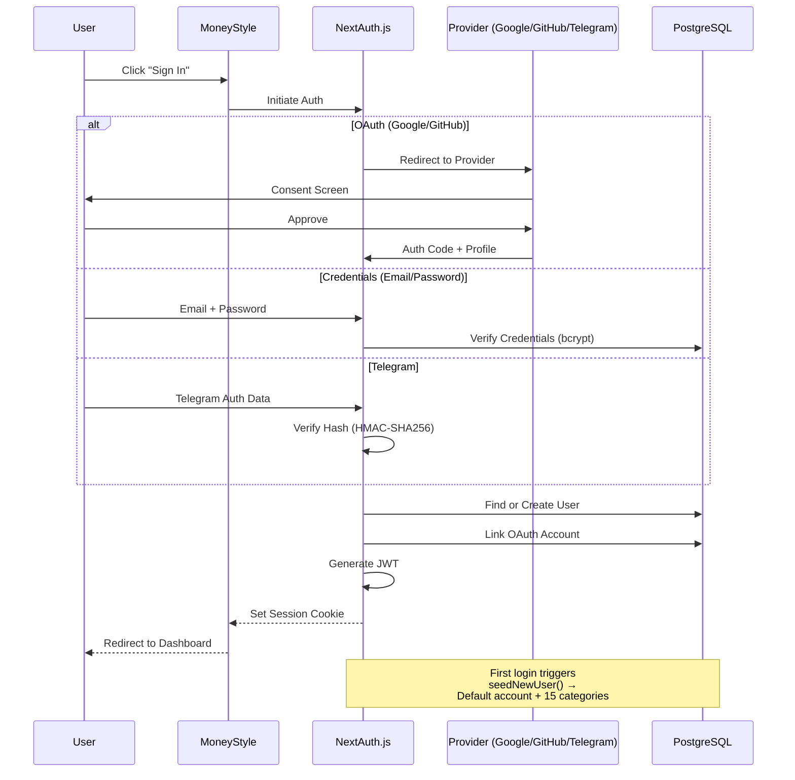

### Auth Providers

| Provider | Method | Notes |
|----------|--------|-------|
| **Google** | OAuth 2.0 | Standard web flow |
| **GitHub** | OAuth 2.0 | Separate dev/prod credentials |
| **Credentials** | Email + Password | bcryptjs hashing |
| **Telegram** | Login Widget + Mini-App | HMAC-SHA256 verification |

### Authorization Model

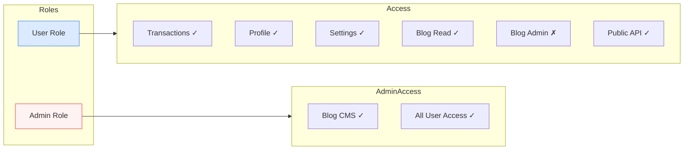

---

## 9. Feature Map

### Feature Hierarchy

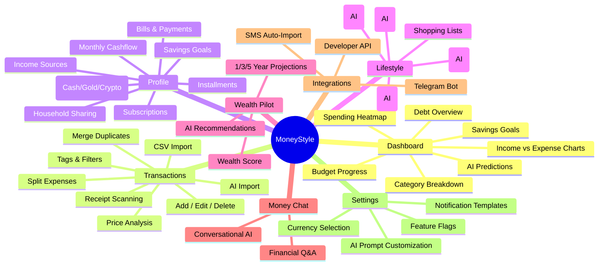

### Feature Maturity Matrix

| Feature | Status | AI-Powered | Mobile-Ready |
|---------|--------|------------|--------------|
| Transaction CRUD | Production | No | Yes |
| Receipt Scanning | Production | Yes (GPT-4V) | Yes |
| Dashboard Charts | Production | No | Yes |
| Budget Tracking | Production | No | Yes |
| Savings Goals | Production | No | Yes |
| Weekend Planner | Production | Yes | Yes |
| Meal Planner | Production | Yes | Yes |
| Money Chat | Production | Yes | Yes |
| Wealth Pilot | Production | Yes | Yes |
| Bill Negotiator | Production | Yes | Yes |
| Telegram Bot | Production | No | Yes |
| SMS Import | Production | No | N/A |
| Household Sharing | Production | No | Yes |
| Price Analysis | Production | No | Yes |
| Public API v1 | Production | No | N/A |
| Spending Wrapped | Production | No | Yes |
| CSV Import | Production | No | Yes |

---

## 10. API Reference

### REST API v1

All API endpoints require an API key passed via `x-api-key` header.

```mermaid
graph LR
    subgraph "API v1 Endpoints"
        direction TB
        TX_LIST["GET /api/v1/transactions"]
        TX_CREATE["POST /api/v1/transactions"]
        TX_GET["GET /api/v1/transactions/:id"]
        TX_UPDATE["PUT /api/v1/transactions/:id"]
        TX_DELETE["DELETE /api/v1/transactions/:id"]

        ACC_LIST["GET /api/v1/accounts"]
        ACC_CREATE["POST /api/v1/accounts"]
        ACC_GET["GET /api/v1/accounts/:id"]
        ACC_UPDATE["PUT /api/v1/accounts/:id"]
        ACC_DELETE["DELETE /api/v1/accounts/:id"]

        CAT_LIST["GET /api/v1/categories"]
        CAT_CREATE["POST /api/v1/categories"]
        CAT_GET["GET /api/v1/categories/:id"]
        CAT_UPDATE["PUT /api/v1/categories/:id"]
        CAT_DELETE["DELETE /api/v1/categories/:id"]
    end

    style TX_LIST fill:#dcfce7,stroke:#22c55e
    style ACC_LIST fill:#dbeafe,stroke:#3b82f6
    style CAT_LIST fill:#fef9c3,stroke:#eab308
```

### Webhook Endpoints

| Endpoint | Method | Auth | Purpose |
|----------|--------|------|---------|
| `/api/telegram/` | POST | Webhook Secret | Telegram bot messages |
| `/api/sms/` | POST | API Key | Bank SMS auto-import |
| `/api/parse-receipt/` | POST | Session | AI receipt parsing |

### Cron Endpoints

| Endpoint | Schedule | Purpose |
|----------|----------|---------|
| `/api/cron/weekend-reminder/` | Thursdays | Send weekend plan reminders |
| `/api/cron/monthly-report/` | 1st of month | Monthly spending summary |
| `/api/cron/installment-reminders/` | Daily | Payment due alerts |

---

## 11. AI Integration

### AI Feature Architecture

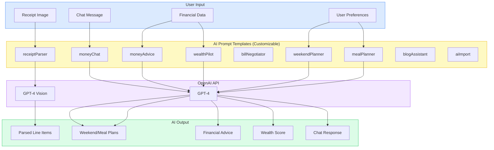

### AI Prompt System

Users can customize all 9 AI prompt templates through the Settings page. Each prompt receives context (financial data, preferences) and produces structured JSON output.

| Prompt | Input | Output |
|--------|-------|--------|
| **Receipt Parser** | Image (JPEG/PNG/WebP/HEIC/PDF) | Line items with quantity, price, merchant |
| **Weekend Planner** | Budget, preferences, location | 3 plans (Budget/Balanced/Premium) |
| **Meal Planner** | Budget, dietary preferences | 7-day meal plan with recipes |
| **Money Advice** | Income, expenses, goals | Personalized financial tips |
| **Bill Negotiator** | Bill details, market rates | Negotiation strategy & scripts |
| **Wealth Pilot** | Full financial profile | Wealth score + projections |
| **Money Chat** | Conversation + financial context | Conversational response |
| **Blog Assistant** | Topic, keywords | Blog post draft |
| **AI Import** | Unstructured text | Structured transactions |

---

## 12. Third-Party Integrations

### Telegram Bot

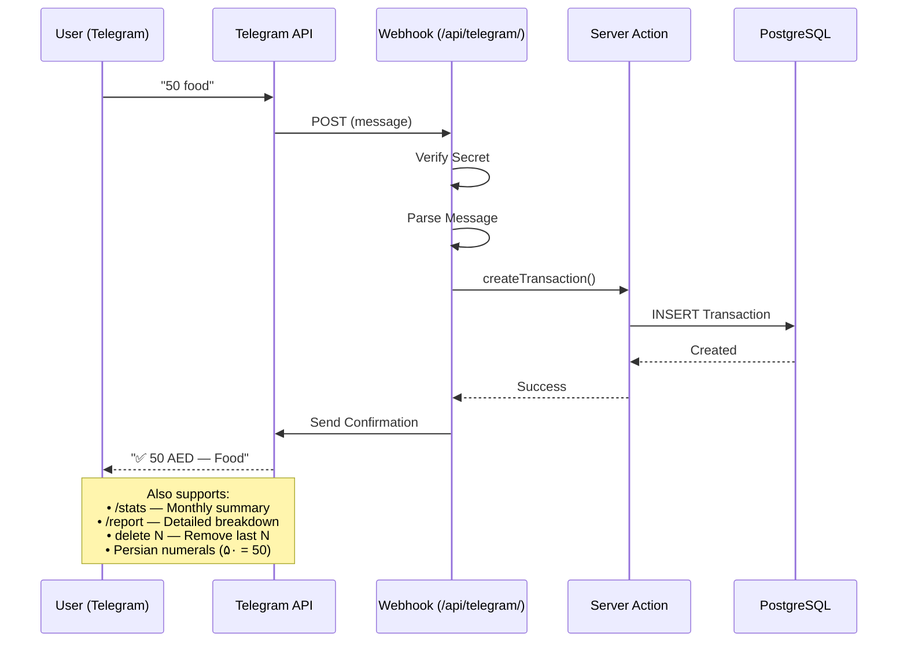

### SMS Auto-Import

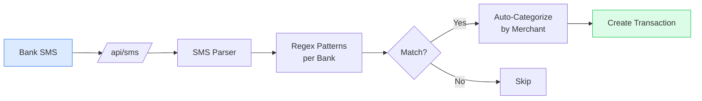

### Storage Architecture

```mermaid
graph TB
    UPLOAD[File Upload] --> STORAGE{Environment}

    STORAGE -->|Development| MINIO[MinIO<br/>localhost:9000]
    STORAGE -->|Production| S3[AWS S3<br/>eu-north-1]

    MINIO --> SERVE[/api/media/path]
    S3 --> SERVE

    SERVE --> CLIENT[Browser]

    style MINIO fill:#fef9c3,stroke:#eab308
    style S3 fill:#dbeafe,stroke:#3b82f6
```

---

## 13. Infrastructure & Deployment

### Docker Architecture

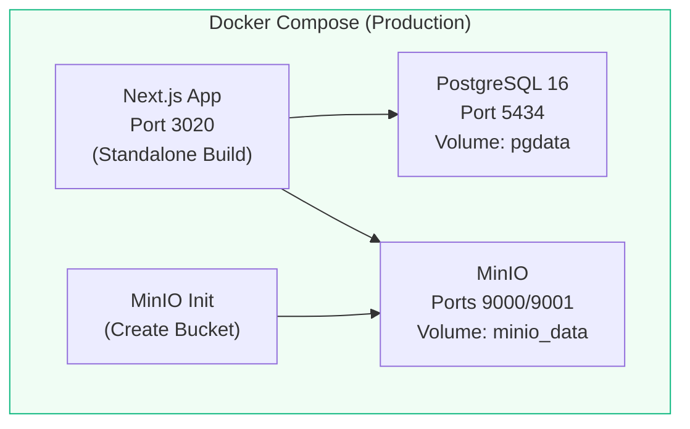

### Dockerfile Build Stages

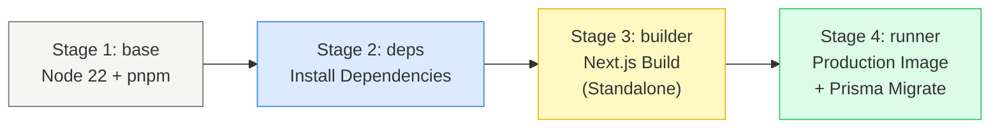

### CI/CD Pipeline

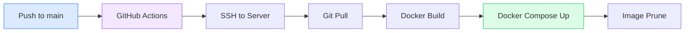

---

## 14. Data Flow Diagrams

### Transaction Creation Flow

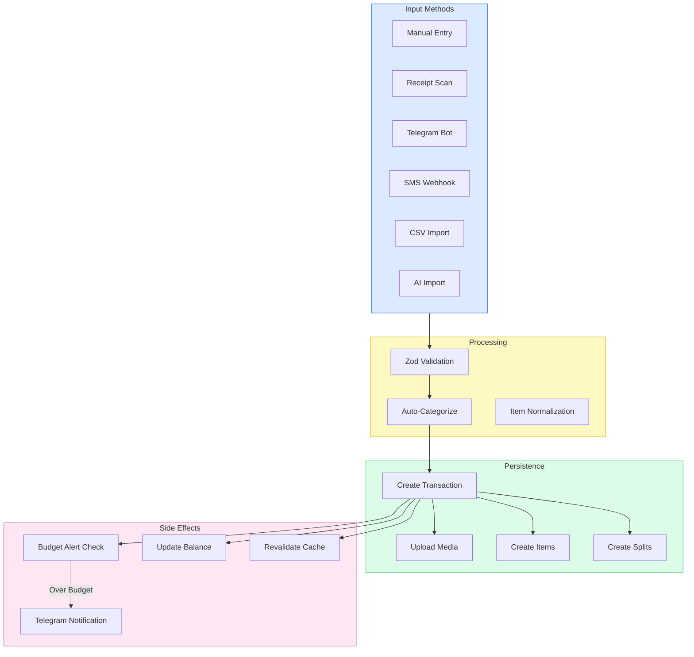

### Dashboard Data Flow

```mermaid
graph TB
    DB[(PostgreSQL)] --> SA[Server Actions]

    SA --> INCOME[getIncomeSummary]
    SA --> EXPENSE[getExpenseSummary]
    SA --> CAT_STATS[getCategoryBreakdown]
    SA --> HEATMAP_DATA[getHeatmapData]
    SA --> BUDGET_DATA[getBudgetProgress]
    SA --> SAVINGS_DATA[getSavingsProgress]
    SA --> PREDICT[getPredictions]

    INCOME --> CHART1[Income/Expense Chart]
    EXPENSE --> CHART1
    CAT_STATS --> PIE[Category Pie Chart]
    HEATMAP_DATA --> HEAT[Spending Heatmap]
    BUDGET_DATA --> BARS[Budget Progress Bars]
    SAVINGS_DATA --> GOALS[Savings Goal Cards]
    PREDICT --> AI_CARD[AI Prediction Card]

    style DB fill:#f3e8ff,stroke:#a855f7
    style SA fill:#fef9c3,stroke:#eab308
```

---

## 15. Security Considerations

### Security Architecture

```mermaid
graph TB
    subgraph Auth["Authentication Layer"]
        JWT[JWT Sessions<br/>Encrypted Tokens]
        BCRYPT[bcryptjs<br/>Password Hashing]
        OAUTH[OAuth 2.0<br/>Google / GitHub]
        HMAC[HMAC-SHA256<br/>Telegram Verification]
    end

    subgraph API_SEC["API Security"]
        API_KEY[API Key Auth<br/>(x-api-key header)]
        WH_SECRET[Webhook Secrets<br/>(Telegram)]
        SMS_KEY[SMS API Key]
        RATE_LIMIT[Middleware Checks]
    end

    subgraph Data_SEC["Data Security"]
        ROW_LEVEL[Row-Level Isolation<br/>(userId filter)]
        ZOD_VAL[Zod Input Validation]
        PRISMA_SAFE[Prisma Parameterized Queries]
        REQUIRE_AUTH[requireAuth() Guard]
    end

    subgraph Infra_SEC["Infrastructure"]
        DOCKER_NET[Docker Network Isolation]
        ENV_VARS[Environment Variables<br/>(not in code)]
        HTTPS[HTTPS (Production)]
    end

    style Auth fill:#dcfce7,stroke:#22c55e
    style API_SEC fill:#dbeafe,stroke:#3b82f6
    style Data_SEC fill:#fef9c3,stroke:#eab308
    style Infra_SEC fill:#f3e8ff,stroke:#a855f7
```

### Security Measures

| Layer | Measure | Implementation |
|-------|---------|---------------|
| **Auth** | Password hashing | bcryptjs with salt rounds |
| **Auth** | Session management | JWT with encrypted tokens |
| **Auth** | OAuth verification | Provider-specific validation |
| **API** | Key authentication | SHA-256 hashed API keys in DB |
| **API** | Webhook verification | HMAC-SHA256 secret verification |
| **Data** | Query safety | Prisma ORM (parameterized queries) |
| **Data** | Input validation | Zod schemas on all mutations |
| **Data** | Row isolation | All queries filtered by `userId` |
| **Data** | Auth guard | `requireAuth()` on all server actions |
| **Infra** | Network isolation | Docker internal network |
| **Infra** | Secrets management | Environment variables |

---

## 16. PWA & Offline Support

### PWA Architecture

```mermaid
graph TB
    subgraph Browser["Browser"]
        APP[Next.js App]
        SW[Service Worker<br/>(Serwist)]
        CACHE[Cache Storage]
        IDB[IndexedDB]
    end

    subgraph Server["Server"]
        PAGES_SRV[Pages]
        STATIC[Static Assets]
        API_SRV[API Routes]
    end

    APP --> SW
    SW --> CACHE
    SW -->|Online| Server
    SW -->|Offline| CACHE

    APP --> IDB

    MANIFEST[manifest.json] -.-> APP

    style Browser fill:#dbeafe,stroke:#3b82f6
    style Server fill:#dcfce7,stroke:#22c55e
```

### PWA Features

- Installable on iOS, Android, Desktop
- Offline page (`/offline`)
- Pull-to-refresh gesture
- App manifest with icons and theme color
- Service worker caching (Serwist)

---

## 17. Analytics & SEO

### Analytics Stack

| Service | Tracking ID | Purpose |
|---------|------------|---------|
| **Google Analytics 4** | G-9XG7N1K1H2 | User behavior, page views |
| **Microsoft Clarity** | vy5ip6fwu0 | Session recordings, heatmaps |
| **Google Search Console** | DNS verified | Search performance |

### SEO Implementation

- Dynamic meta tags (title, description, OG, Twitter)
- Structured data (JSON-LD: SoftwareApplication, Organization)
- Auto-generated sitemap (`/sitemap.xml`)
- Auto-generated robots.txt (`/robots.txt`)
- Dynamic feature pages (`/features/[slug]`)
- Blog with SEO-optimized posts

---

## 18. Feature Flags

### Feature Flag System

MoneyStyle uses a per-user feature flag system stored in `AppSettings.featureFlags`.

```mermaid
graph LR
    subgraph Flags["28 Feature Flags"]
        direction TB
        AI_FLAGS["AI Features<br/>moneyAdvice, billNegotiator,<br/>weekendPlanner, mealPlanner,<br/>chat, wealthPilot,<br/>receiptScanner, priceAnalysis"]
        TX_FLAGS["Transaction Features<br/>txAdd, txEdit, txDelete,<br/>txSplit, txItems, txConfirm,<br/>transactionMerge"]
        IMPORT_FLAGS["Import Features<br/>importCsv, importAi,<br/>importTelegram"]
        DASH_FLAGS["Dashboard Features<br/>dashPrediction, dashBudgets,<br/>dashSavings, dashDebts,<br/>dashCategoryChart, dashHeatmap,<br/>dashCharts"]
        LIFE_FLAGS["Lifestyle<br/>shoppingLists,<br/>spendingWrapped"]
    end

    GATE[FeatureGate Component] --> Flags

    style AI_FLAGS fill:#f3e8ff,stroke:#a855f7
    style TX_FLAGS fill:#dcfce7,stroke:#22c55e
    style IMPORT_FLAGS fill:#dbeafe,stroke:#3b82f6
    style DASH_FLAGS fill:#fef9c3,stroke:#eab308
    style LIFE_FLAGS fill:#fce7f3,stroke:#ec4899
```

### Usage in Components

```tsx
<FeatureGate feature="dashBudgets">
  <BudgetProgressWidget />
</FeatureGate>
```

---

## 19. Development Guide

### Prerequisites

- Node.js 22+
- pnpm 10+
- Docker & Docker Compose
- PostgreSQL 16 (via Docker)

### Quick Start

```bash
# Clone & install
git clone <repo-url>
cd revenue
pnpm install

# Start services (PostgreSQL + MinIO)
docker compose up -d postgres minio minio-init

# Setup database
pnpm prisma migrate dev
pnpm prisma db seed

# Start dev server
pnpm dev
```

### Available Scripts

| Command | Description |
|---------|-------------|
| `pnpm dev` | Start dev server (Turbopack) |
| `pnpm build` | Production build |
| `pnpm start` | Start production server |
| `pnpm prisma migrate dev` | Run migrations |
| `pnpm prisma studio` | Open Prisma Studio |
| `pnpm prisma db seed` | Seed database |

### Key Conventions

- **Server Actions** — All mutations via `"use server"` functions in `src/actions/`
- **Auth Guard** — Always use `requireAuth()` in server actions
- **Validation** — Zod schemas for all input (`src/lib/validators.ts`)
- **Cache** — `revalidatePath()` after mutations
- **UI** — shadcn/ui components, ResponsiveDialog for modals
- **Mobile-First** — Design for mobile, scale up to desktop

### Server Action Pattern

```typescript
"use server";

import { requireAuth } from "@/lib/auth-utils";
import { db } from "@/lib/db";
import { z } from "zod";
import { revalidatePath } from "next/cache";

const schema = z.object({
  name: z.string().min(1),
  amount: z.number().positive(),
});

export async function createItem(data: z.infer<typeof schema>) {
  const user = await requireAuth();
  const validated = schema.parse(data);

  const item = await db.item.create({
    data: { ...validated, userId: user.id },
  });

  revalidatePath("/items");
  return item;
}
```

---

## 20. Glossary

| Term | Definition |
|------|-----------|
| **App Router** | Next.js routing system using file-system based routing with `app/` directory |
| **Server Action** | Server-side function callable directly from client components |
| **RSC** | React Server Components — rendered on the server, no client JS |
| **PWA** | Progressive Web App — installable web app with offline support |
| **Prisma** | Type-safe ORM for Node.js and TypeScript |
| **shadcn/ui** | Copy-paste component library built on Radix UI |
| **ResponsiveDialog** | Custom component: Dialog on desktop, Drawer on mobile |
| **FeatureGate** | Component wrapper that shows/hides based on feature flags |
| **Wealth Pilot** | AI feature that scores financial health and projects growth |
| **Money Chat** | Conversational AI assistant for financial questions |
| **MinIO** | Open-source S3-compatible object storage |
| **Serwist** | Service worker library for PWA support in Next.js |
| **Zod** | TypeScript-first schema validation library |
| **JWT** | JSON Web Token — stateless authentication tokens |
| **HMAC** | Hash-based Message Authentication Code |

---

*Generated: March 2026 | MoneyStyle v1.0*
